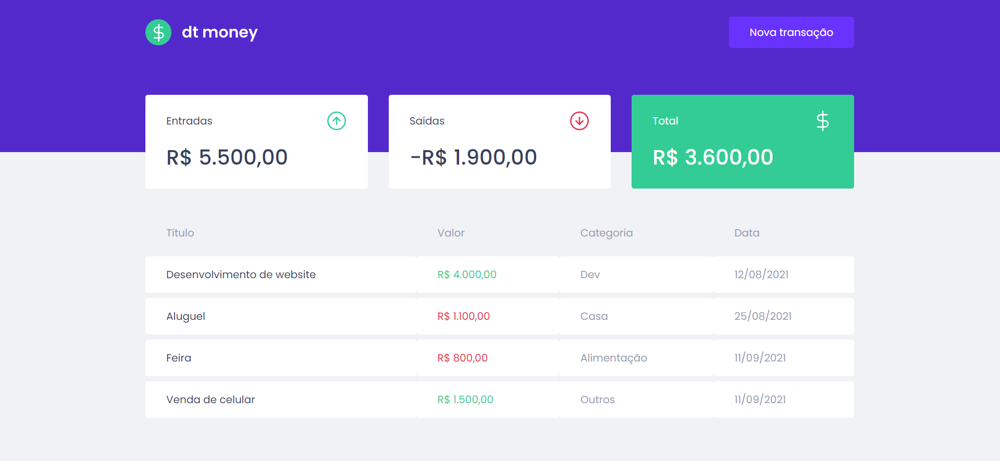
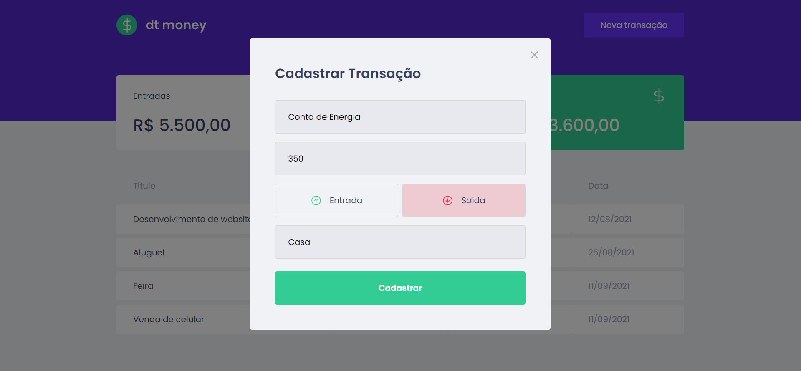

## Dtmoney - Ignite

 
    
 

Projeto do capítulo 2 do Ignite da Rocketseat. A ideia é ter um dashborad com transações de entradas e saídas, cards de resumo e um modal de cadastro de transações.

## Exemplos

